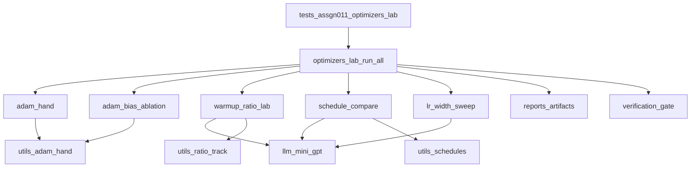
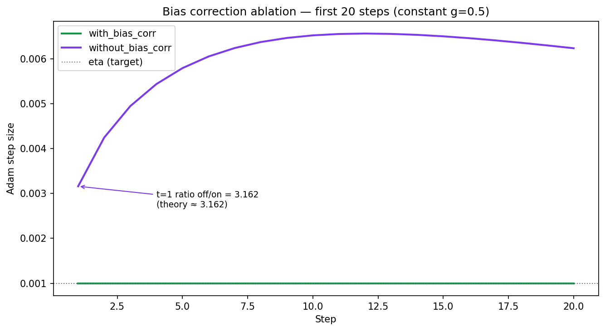
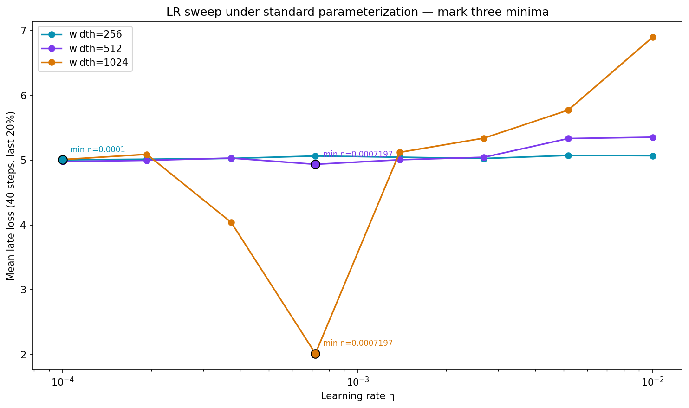

# Session 11 — Optimizers and Learning-Rate Schedules

---

## 1. Core Architecture & Mathematical Foundations

### Engineering problem

Session 10 left `optimizer.step()` unspecified. Session 11 fills that line: convert a gradient into a **distance**. Graded work: Adam by hand, bias-correction plot, update/weight ratios, cosine vs WSD early-stop, LR sweep across width.

### High-level architecture

Notebook and CLI both call `run_all` → five task modules → `reports/` artifacts and the verification gate.



### Adam (Task 1 textbook table)

```text
m_t  = beta1 * m_{t-1} + (1 - beta1) * g_t
v_t  = beta2 * v_{t-1} + (1 - beta2) * g_t^2
mhat = m_t / (1 - beta1^t)
vhat = v_t / (1 - beta2^t)
step = eta * mhat / (sqrt(vhat) + eps)
w_t  = w_{t-1} - step
```

Hand vs `torch.optim.Adam` on FULL §6 grads `[0.50, 0.40, 0.60, 0.45, 0.55]`, `w0=1`, `eta=0.001`, `beta1=0.9`, `beta2=0.999`: max abs err `1.110e-16` (PASS, tol `1e-6`). Final `w_5 = 0.995031`. Every recorded field (`m`, `v`, `mhat`, `vhat`, step, `w`) matches PyTorch to machine precision.

### Bias correction (Task 2)

```text
t=1 without correction: step ≈ eta * (1 - beta1) / sqrt(1 - beta2) ≈ 3.162 * eta
t=1 with correction:    step ≈ 1.000 * eta
```

Measured off/on ratio at t=1: **3.162276** (theory 3.162278). Primary plot: `reports/assgn011_bias_correction_20.png` (constant `g=0.5`, first 20 steps with bias correction off vs on).

**Explanation — when the difference stops mattering.** The assignment asks for the step after which disabling bias correction no longer matters. Under the lab gate (relative error stays below `1e-3` for all remaining `t`), that crossover is **not reached inside the first 20 steps**. Study material notes the asymptotic gap shrinks over roughly **1000** steps. The graded deliverable is therefore the 20-step ablation plot plus the t=1 ~3.16× overshoot explanation (why warmup exists). Production trainers never disable bias correction; this arm is pedagogical only.

### Update/weight ratio (Task 3)

Train MiniGPT with AdamW under linear warmup and log per-layer

```text
ratio = ||Δw||_2 / (||w||_2 + eps)
```

Detect `T*` as the step where warmup stops changing that ratio. PASS run: `T* = 50` (equals warmup length `W`), late median ratio ≈ `7.67e-3`. Plot: `reports/assgn011_update_weight_ratio.png`.

Protocol: MiniGPT `n_embd=64`, `n_layer=2`, `block_size=64`; AdamW `beta1=0.9`, `beta2=0.95`, `wd=0.1`, `peak_lr=0.003`, warmup `50` of `300`. Detector: first post-peak step where median ratio changes < 5% over a 5-step window; CSV rows `8700`; lecture target ~`1e-3` (measured late median ≈ `7.67e-3`).

**Explanation — why T* lands at warmup end.** Once LR reaches peak, update magnitudes settle; the detector marks the first post-peak window where the median ratio stops shifting, so `T*` coincides with `W` on this smoke run.

### Cosine vs WSD (Task 4) — 300 plan, stop at 200

Plan each run for **300** steps so cosine’s horizon is fixed (`T_max=300`).  
**Stop / keep-decision at step 200:** report both losses and choose which model to keep.  
Loss@300 (if the run continues) is optional analysis only — not a prediction.

Matched MiniGPT / AdamW — cosine vs WSD (warmup=6, stable≈264, decay=30): `seed=42`, `peak_lr=3e-3`, `warmup=6`, `batch=4`, `block_size=64`, 300 steps. That matched budget is the assignment’s “tune both sides” constraint.

| Schedule | Loss @ 200 | Loss @ 300 | Keep |
| :--- | ---: | ---: | :--- |
| cosine | 5.558471 | 5.554020 | no |
| WSD | 5.561609 | 5.556404 | **yes** |

**Explanation — keep WSD on a near-tie.** Cosine Loss@200 is slightly lower, but the keep rule is structural, not “always pick the lower number.” The lab keeps WSD when `wsd_loss_200 <= cosine_loss_200 * 1.05` (here both sit inside that band). FULL §10: by step 200 of a 300-step cosine plan, LR has already spent horizon budget toward the fixed `T_max`; WSD still holds near-peak LR on the stable phase and can checkpoint, branch, and continue. Keep **WSD**.

### Width / LR transfer (Task 5)

| Width | Best η (SP) | Late loss |
| ---: | ---: | ---: |
| 256 | 0.0001 | 5.004481 |
| 512 | 0.000719686 | 4.936011 |
| 1024 | 0.000719686 | 2.013629 |

```text
SP:  eta_4096 ≈ eta_1024 / 4  → 0.000179921   confidence LOW
```

Protocol: matched budget 40 steps per (width, η) point; `batch=2`, `block_size=32`, AdamW `beta2=0.95`; parameterization **SP**.

Under standard parameterization, η scales roughly as `1/width`. Transferring a small-width minimum to width 4096 can overstate usable η by up to ~16× (256→4096); without a μP day we report confidence **LOW**.

### Salient features

- Pure-Python Adam hand path + PyTorch mirror gate
- Custom `WSDScheduler` (warmup / stable / cosine decay)
- Per-layer `||Δw||/||w||` CSV + T* detector

---

## 2. Hardware Constraints & Memory Footprint

### AdamW 16-byte rule (pedagogical)

```text
bytes/param ≈ 4 (w) + 4 (grad) + 4 (m) + 4 (v) = 16
```

On a 9B model that is tens of GiB of optimizer state alone (FULL §8). This lab uses small MiniGPT smoke models.

### This repo's smoke run

| Arm | Model | Steps | Notes |
| :--- | :--- | ---: | :--- |
| Task 3 ratio | MiniGPT n_embd=64 | 300 | warmup 50, β2=0.95 |
| Task 4 schedules | MiniGPT n_embd=64 | 300 | keep-decision @200 |
| Task 5 sweep | widths 256/512/1024 | 40 / point | matched tokens |

### Long context

When scaling context length, keep **global batch token count fixed per phase** (Session 10 invariant). Do not silently retune η mid-curriculum.

---

## 3. Empirical Evaluation & Benchmarks

A PASS lab writes **13** artifacts under `reports/` (9 text/csv/json + 4 PNGs). Numbers below are from the current local PASS run; Colab reproduces the same conclusions.

### Results by task (technical)

| Task | Result | Technical read |
| :--- | :--- | :--- |
| 1 Hand Adam | PASS; max abs err `1.110e-16`; `w_5 = 0.995031` | Hand `m`/`v`/`mhat`/`vhat`/step/`w` over five FULL §6 gradients agree with `torch.optim.Adam` within tol `1e-6` |
| 2 Bias ablation | off/on @ t=1 = **3.162276** (theory 3.162278); crossover not in 20 steps | Uncorrected first step ~3.16×η; explains warmup. Graded view is the 20-step off/on curves |
| 3 Update/weight | `T* = 50` (= warmup `W`); late median ratio ≈ `7.67e-3` | Ratio `||Δw||/||w||` per layer; warmup stops changing the ratio once LR reaches peak at step 50 |
| 4 Cosine vs WSD | Loss@200 cosine 5.558471 / WSD 5.561609; keep **WSD** | Near-tie on loss; keep uses early-stop structure (WSD still near peak LR). Loss@300 optional |
| 5 LR × width | minima: 256→0.0001, 512→0.000720, 1024→0.000720; `eta_4096 ≈ 0.000180` **LOW** | SP `eta ∝ 1/width`; small→large transfer risk → low confidence |

### Gate snapshot

Each row is the comparison behind that task's `ok`. `all_ok` is the AND of these flags plus both PRIMARY PNGs (bias ablation + LR width sweep) non-empty.

| Task | Measured | Other side | Criterion | OK |
| :--- | :--- | :--- | :--- | :---: |
| 1 Hand Adam | 1.110e-16 | tol=1e-6 | max_abs_err < tol | True |
| 2 Bias plot | 3.162276 | 3.162278 | abs(measured - theory) < 1e-2 + PRIMARY PNG | True |
| 3 Ratio / warmup | T*=50 | W=50 | T* not None + CSV/PNG | True |
| 4 Cosine vs WSD | 5.558471 | 5.561609; keep=WSD | both Loss@200 present + PNG | True |
| 5 LR sweep | 0.000719686 | 0.000179921; conf=LOW | 3 minima + PRIMARY PNG; SP eta_4096 = eta_1024/4 | True |

### Primary plots (what each PNG shows)

| Plot | File | What it shows |
| :--- | :--- | :--- |
| Bias correction (PRIMARY) | `reports/assgn011_bias_correction_20.png` | First 20 Adam steps with bias correction off vs on |
| LR width sweep (PRIMARY) | `reports/assgn011_lr_width_sweep.png` | Loss vs η at widths 256 / 512 / 1024 with three minima marked |
| Update/weight ratio | `reports/assgn011_update_weight_ratio.png` | Per-layer `||Δw||/||w||` over training; warmup end near `T*` |
| Cosine vs WSD | `reports/assgn011_cosine_vs_wsd.png` | Matched cosine vs WSD loss and LR; vertical mark at stop@200 |





### Google Colab verification run

A successful Colab lab cell prints:

```text
all_ok: True
task1_adam_hand -> True  max_abs_err=1.110e-16  vs  tol=1e-6
task2_bias -> True  measured=3.162276  vs  theory=3.162278
task3_ratio -> True  T*=50  vs  W=50
task4_schedules -> True  cosine@200=5.558471  vs  WSD@200=5.561609  keep=WSD
task5_lr_sweep -> True  eta_1024=0.000719686  vs  eta_4096_sp=0.000179921  conf=LOW
```

Same numeric conclusions as local `reports/`: Adam hand PASS (sub-`1e-15` abs err), bias t=1 ≈ 3.162, keep **WSD** with the Loss@200 pair above, SP `eta_4096 ≈ 0.000180` with confidence **LOW**, and the full **13-file** `reports/` set including both PRIMARY PNGs. Twin local gate:

```text
python tests/assgn011_optimizers_lab.py
python -m pytest tests/test_assgn011.py -q
```

Gate summary: [Assgn011_Summary.md](reports/Assgn011_Summary.md).

---

## 4. Repository Structure & File Registry

```text
Assign_0011/
|-- requirements.txt
|-- requirements-jupyter.txt
|-- README.md
|-- src/
|-- tests/
|-- notebooks/
`-- reports/
```

---

## 5. Execution Guide

### Setup

```text
# Windows:
python -m venv .venv
.venv\Scripts\pip install -r requirements.txt
# Local Jupyter only (do NOT install on Google Colab):
# .venv\Scripts\pip install -r requirements-jupyter.txt
```

### Full assignment lab

```text
python tests/assgn011_optimizers_lab.py
python -m pytest tests/test_assgn011.py -q
```

### Notebook

```text
# from Assign_0011 root
jupyter notebook notebooks/assgn011_optimizers.ipynb
```
