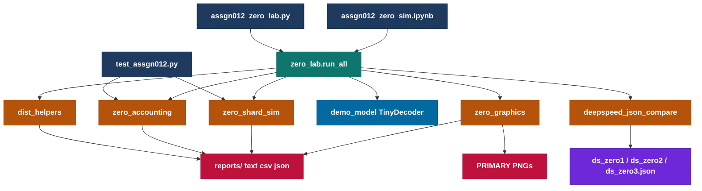
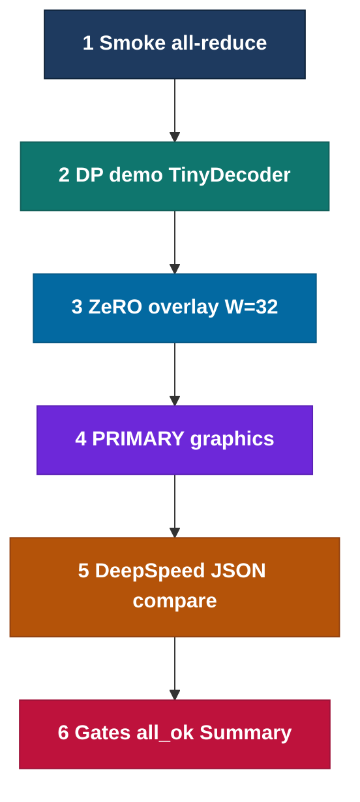
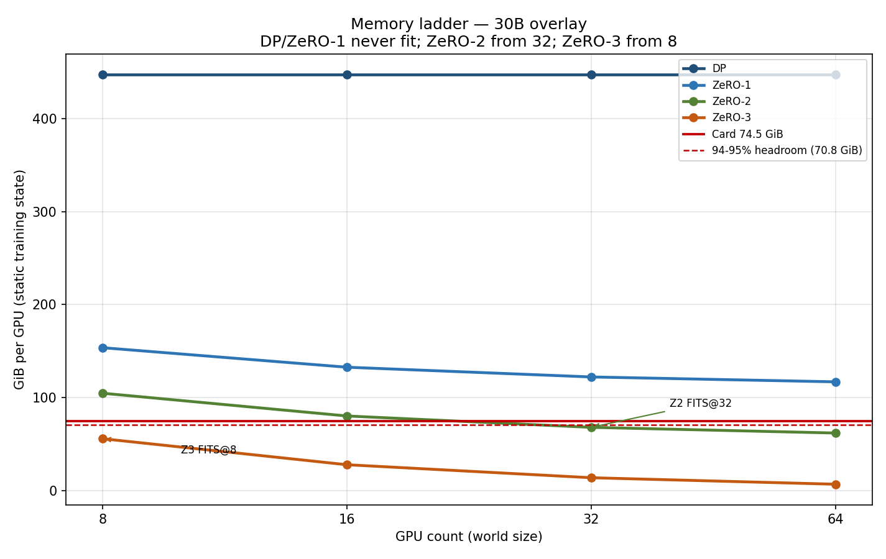
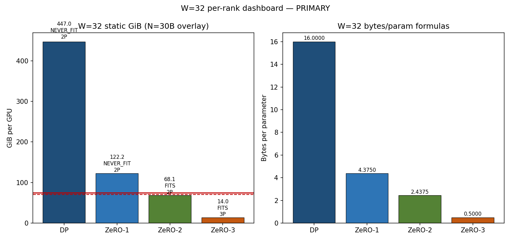
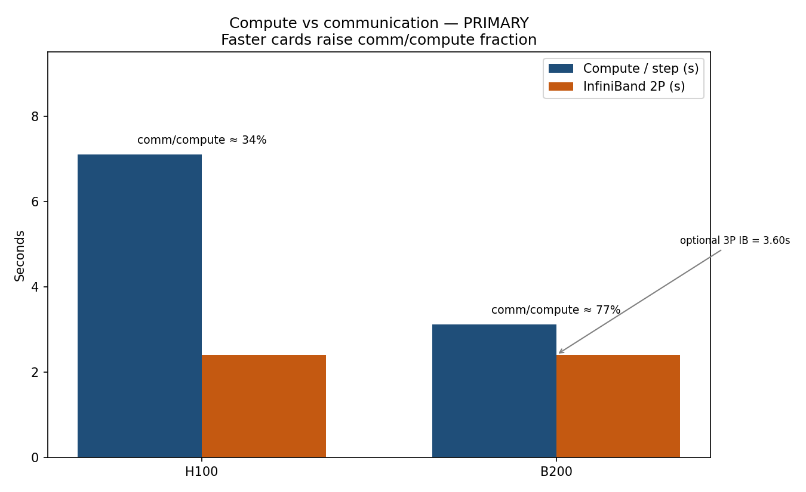

# Assign_0012 — Distributed Training I: Data Parallel and ZeRO

Simulate **32 virtual GPUs**, run a tiny demo model, reproduce **ZeRO-1 / ZeRO-2 / ZeRO-3** memory and communication accounting against Session 12 formulas, and **show** the results with PRIMARY graphics.

---

## High-level architecture



## Lab process



---

## 1. What this lab proves

```text
16 bytes/param × 30e9 = 447.0 GiB static training state
P = 60 GB (FP16/BF16 parameter footprint)
DP / ZeRO-1 / ZeRO-2 comm = 2P
ZeRO-3 comm = 3P
Card = 80 GB marketing ≈ 74.5 GiB addressable
Fit uses 94–95% of 74.5 GiB (≈70.8 GiB headroom line)
W=8 bytes/param = 16.00 / 5.50 / 3.75 / 2.00
```

| Stage | Bytes/param | Comm | 30B @ W=32 | Fit on 74.5 GiB? |
| :--- | ---: | :---: | ---: | :--- |
| DP | 16 | 2P | 447.0 GiB | NEVER |
| ZeRO-1 | 4 + 12/W | 2P | 122.2 GiB | NEVER |
| ZeRO-2 | 2 + 14/W | 2P | 68.1 GiB | FITS (≥32 GPUs) |
| ZeRO-3 | 16/W | 3P | 14.0 GiB | FITS (≥8 GPUs) |

---

## 2. Empirical evaluation

A PASS lab writes text/csv/json under `reports/` plus **three PRIMARY PNGs** (and one recommended activation plot). Every `ok` is shown with operands (never a naked `True`). Overlay always uses W=32 even when the demo runs on 1 rank.

### 2.1 Results by task

| Task | Result | Technical read |
| :--- | :--- | :--- |
| 1 Smoke | PASS; `smoke_sum=1.0`; `world_size=1`; `backend=none` | Collective fabric present even on 1 rank; overlay still uses W=32 |
| 2 DP demo | PASS; `N_demo=49920`; `max \|w_i−w_0\|=0.0` | Averaged grads keep replicas identical; 30B is **not** loaded |
| 3 ZeRO overlay | PASS; `mismatches=0`; W=32 GiB **447.0 / 122.2 / 68.1 / 14.0**; floor **111.76 GiB** | Matches Session 12 formulas (`16`, `4+12/W`, `2+14/W`, `16/W`) |
| 4 Graphics | PASS on the machine that ran the lab (`primary_pngs=3`) | Graded proof is the three PRIMARY PNGs |
| JSON compare | PASS; `stages_pass=3/3`; Δ=0.000 | `ds_zero{1,2,3}.json` `stage` → same GiB as the lab table @ W=32 |







---

## 3. Pros and cons (brief)

| Stage | Pros | Cons |
| :--- | :--- | :--- |
| DP | Simple; identical to larger single-GPU batch | Full replica; never fits 30B |
| ZeRO-1 | Shards optimizer (12 B); same 2P | Params+grads still full; never fits 30B |
| ZeRO-2 | Fits from 32 GPUs; still 2P | ~6.4 GiB headroom before activations |
| ZeRO-3 | Fits from 8 GPUs; lowest static | Comm rises to 3P |

---

## 4. Long context

Activations scale with batch × sequence length and sit **on top** of the ZeRO ladder. ZeRO-2 at 32 GPUs is 68.1 GiB static on a 74.5 GiB card (~6.4 GiB under the 94–95% line) — long sequences force activation checkpointing (~+30% compute) or ZeRO-3.

---

## 5. DeepSpeed vs FSDP2 (know-about)

ZeRO is the **design**. DeepSpeed implements stages 1–3 with JSON + offload. FSDP2 (`fully_shard` + DTensor) is PyTorch's stage-3 path from 2.6+. This lab uses **explicit shard accounting** so Colab/Windows stay light — no DeepSpeed install required.

`ds_zero{1,2,3}.json` `stage` → same GiB as the lab table (3/3, Δ=0).

---

## 6. Public vs undisclosed

| Public | Undisclosed (do not invent) |
| :--- | :--- |
| Microsoft DeepSpeed ZeRO (2019) | Anthropic Claude training parallel |
| PyTorch FSDP / FSDP2 | Current OpenAI / Gemini sharding |

---

## 7. Google Colab verification run

```text
task1_smoke.ok=True  smoke_sum=1.0  world_size=1  backend=none
task2_dp.ok=True  max_abs_diff=0.0  N_demo=49920  peak_rss_mb=383.828125
task3_zero.ok=True  mismatches=0  W32_GiB=447.0/122.2/68.1/14.0  floor_gib=111.75870895385742
task4_graphics.ok=True  primary_pngs=3
task_json_compare.ok=True  stages_pass=3/3
all_ok=True  (PASS if True; FAIL if False)
```

---

## 8. Setup

```text
python -m venv .venv
.venv\Scripts\activate
pip install -r requirements.txt
```

---

## 9. Run

### 9.1 Single-process lab (accounting + graphics + demo on 1 rank)

```text
python tests/assgn012_zero_lab.py
python -m pytest tests/test_assgn012.py -q
```

### 9.2 Multi-process virtual GPUs (real `torch.distributed`, gloo)

**Linux / Colab** (when `torchrun` works):

```text
torchrun --nproc_per_node=32 -m tests.assgn012_zero_lab
```

**Colab (1-rank lab, same overlay numbers):** unzip to `/content/Assign_0012` (not relative `content/...`), open `notebooks/assgn012_zero_sim.ipynb`, run cells. The analytic overlay always uses W=32.

Backend: **gloo** on CPU/Windows; NCCL only when multi-GPU CUDA is available.

---

## 10. Step by step


```text
1.  String:   The United States of America is marginally ahead of AI development
2.  Tokens:   11 words (DP demo: first 8 active; tokens 9–11 overflow)
3.  IDs:      11 22 33 44 55 66 77 88 99 110 121
4.  Tensor:   shape [B, T] on device (VRAM, not host RAM)
5.  Forward:  embeddings + layers → logits
6.  Loss:     scalar wrongness
7.  Backward: gradient for every weight
8.  Adam:     up to 16 bytes of state per weight (param+grad+m+v)
9.  Problem:  30B × 16 B = 447.0 GiB  >  74.5 GiB addressable (80 GB card)
10. DP:       split the 8 tokens across ranks; full replica per GPU; still 447 GiB/GPU; all-reduce grads; |w_i−w_0|≈0
11. Collectives / ring: reduce-scatter + all-gather = all-reduce = 2P (P = 60 GB at 30B)
12. ZeRO:     shard the 16 bytes — Z1 optimizer, Z2 +grads, Z3 +params
              bytes/param: 16 | 4+12/W | 2+14/W | 16/W
              replicated floor 4 B/param ≈ 111.8 GiB → DP and Z1 never fit
              W=32 overlay: 447.0 / 122.2 / 68.1 / 14.0 GiB → Z2@32 and Z3@8 fit
13. Comm:     H100 ~34% vs B200 ~77% comm/compute; ZeRO-3 pays 3P
14. Verify:   reports + pytest; boolean WITH full values (never a naked True)
15. Long S:   activations sit on top of the ZeRO ladder; Z2@32 has ~6.4 GiB headroom → checkpoint (~+30% compute) or ZeRO-3
16. JSON:     ds_zero{1,2,3}.json stage → same GiB as the lab table (3/3, Δ=0)
17. PRIMARY:  memory_ladder.png, w32_dashboard.png, compute_comm.png (activation_vs_seq.png )
```
